Conventional smart contracts deployed on traditional blockchains are forced to operate in a restricted, rigid, isolated, and deterministic way. Excellent for security but highly limiting.

What if we could empower them to access the web, understand natural language, crunch unstructured data, and make subjective decisions all by themselves? These "super-contract" abilities make them so smart, that we could rightfully call them *Intelligent*.

```mermaid
graph TD
    web((🌐 Web Access))
    decision((⚖️ Subjective Decision))
    brain((🧠 Intelligent Contracts))
    language((🗣 Natural Language))
    data((🧾 Unstructured Data))

    brain --> web
    brain --> decision
    brain --> language
    brain --> data
```

## Beyond Smart Contracts: The Rise of Intelligent Contracts

<a href="https://docs.genlayer.com/developers/intelligent-contracts/introduction" target="_blank" rel="noopener noreferrer">GenLayer's Intelligent Contracts</a> are a natural next step in the evolution of blockchains. Unlike Smart Contracts which only speak code and require precise programming for exact rules and conditions, Intelligent Contracts leverage LLMs for real-time data retrieval and natural language processing.

When I first encountered the concept, I was blown away—it was hard to believe that anyone could bridge the deterministic nature of blockchains with the inherently non-deterministic behavior of LLMs.

To summarize, Intelligent Contracts offer:

```mermaid
graph LR 
    A[Intelligent Contracts] --> B[🗣️ Natural Language Fluency]
    A --> C[🌐 Native Web Connection]
    A --> D[🧠 Stateful Execution]
    A --> E[🧮 Complex Computations]
    A --> F[🐍 Python Ecosystem]
```

1. **Natural Language Fluency** – process natural language, enabling more flexible interactions and accessibility to a wider range of builders  
2. **Native Web Connection** – directly fetch off-chain data via APIs or web scraping for flexible and dynamic decision-making, all while avoiding third-party oracles  
3. **Stateful Execution** – maintain state and memory, allowing them to evolve over time based on historical context  
4. **Ability to perform complex computations** like floating-point operations  
5. **Familiar and powerful tools of Python's ecosystem**

Intelligent contracts can fetch live data (e.g. prices 📈, weather updates 🌦️, product details 🛒) directly from web APIs without intermediaries, making subjective decisions while enhancing adaptability and context awareness. They can also search and retrieve real-time information, such as breaking news or sports scores, allowing dapps to decide on insurance payouts and game results.

Learn about <a href="https://docs.genlayer.com/developers/intelligent-contracts/introduction" target="_blank" rel="noopener noreferrer">Intelligent Contracts</a> or try deploying your own in <a href="https://studio.genlayer.com" target="_blank" rel="noopener noreferrer">GenLayer Studio</a>.

## Optimistic Democracy: A New Era of Consensus

<a href="https://docs.genlayer.com/understand-genlayer-protocol/optimistic-democracy-how-genlayer-works" target="_blank" rel="noopener noreferrer">Optimistic Democracy</a> is GenLayer's consensus mechanism for non-deterministic operations, such as those involving LLM inference and real-time web data.

In Ethereum and other L1 chains, validators only need to agree on transaction ordering, because re-executing a transaction will always yield the same result. In GenLayer, however, the consensus operates on the transaction level because each transaction can produce a different response. Thus, instead of agreeing on the order of transactions, the GenLayer validators have to first agree on the non-deterministic LLM responses and web search results.

I couldn't wrap my head around it at first — how do LLM-powered validators even agree on transaction outputs when the LLM responses and web results aren't deterministic?

### Equivalence Principle
Turns out, each transaction consists of deterministic and non-deterministic parts. The former could be easily re-executed by each validator to verify valid state change. But the latter will yield different results. That's where validators employ the Equivalence Principle to evaluate whether the leader-proposed output is valid.

### Optimistic Validation

To minimize LLM inference costs, GenLayer allocates a subset of validators with a random leader to each transaction. The chances of being selected into the subset are proportional to the validator's total stake. Users can ensure single-round finality by paying for more validators, while developers can set method-specific minimums.

A leader proposes the output for non-deterministic calls, while others attest its quality using the Equivalence Principle. Here's how it works:

- The lead validator records its execution trace in the **transaction receipt**, including non-deterministic inputs and outputs.  
- Validators perform **two runs**.  
- **First run:** deterministic part is re-executed; non-deterministic outputs are taken from the leader.  
- **Second run:** full execution with validator-generated outputs, then compared against leader's using the Equivalence Principle.  
- If every output passes, the validator accepts the leader's response. Equivalence checks are parallelized for performance.

### Appeals

For cases when validators fail to reach consensus, an external validator can submit an appeal request during the finality window. This doubles the validator set and picks a new leader. The process can go for several rounds until full finality is reached.

Read more on Optimistic Democracy in GenLayer's <a href="https://www.genlayer.com/whitepaper" target="_blank" rel="noopener noreferrer">Whitepaper</a>.

## Transforming Prediction Markets

As an example use case, let's take prediction markets, which depend on accurate, timely data.

Current prediction markets operate by consuming oracle-provided real-time data to enable smart contracts to make deterministic decisions about specific outcomes. That means for each event, poll, or sports game, a new rigid oracle infrastructure has to be configured. Another drawback is dispute resolutions lasting up to 98 hours.

GenLayer's core capabilities, such as native internet connectivity and ability to understand natural language, avoid using oracles altogether while offering the same or better level of security. The recent implementation of <a href="https://www.genlayer.com/post/the-intelligent-oracle-real-time-data-access-for-the-next-generation-of-dapps" target="_blank" rel="noopener noreferrer">Intelligent Oracle</a>, which is based on Intelligent Contracts, brings any web data on-chain. Other advantages include:

- Short finality, usually under an hour  
- Prediction markets could be resolved for a fraction of the cost of current oracle-based solutions  
- Instant event resolutions via autonomous web scraping for relevant real-time data  

Other use cases requiring more flexible oracle solutions that need to bring data on chain in a trustless way could benefit from utilizing <a href="https://www.genlayer.com/post/the-intelligent-oracle-real-time-data-access-for-the-next-generation-of-dapps" target="_blank" rel="noopener noreferrer">Intelligent Oracle</a>.

---

## Sources  
<a href="https://blog.genlayer.com/" target="_blank" rel="noopener noreferrer">GenLayer Blog</a> | <a href="https://docs.genlayer.com/" target="_blank" rel="noopener noreferrer">GenLayer Docs</a> | <a href="https://www.genlayer.com/whitepaper" target="_blank" rel="noopener noreferrer">GenLayer Whitepaper</a>
