*Making sense of cyber chaos, one insight at a time.*

---

## 🚨 Introduction

Back at my previous job—a cybersecurity company that really took security seriously—I got phished at least twice a week. Not by real attackers, thankfully, but by our own security team. "Action Required: Missed Compliance Training," "Performance Review Document Attached," "Click here for your bonus!"... It became a game of spotting the red flags, but I embraced it. Because the threats out there? They're no joke. Breaches, ransomware crews, zero-days—you name it. It's nonstop.

```mermaid
sequenceDiagram
    box Me & SOC
    actor Rashid
    participant SOC
    end
    box Purple Security Training
    actor InfoSec
    end
    SOC->>Rashid: 📨 Click here for your bonus...
    Rashid->>SOC: 🤩Let's snatch it!
    SOC->>InfoSec: Assigning Rashid to training
    InfoSec->>Rashid: Hey Rashid, welcome to Cyber School 😉
    Rashid->>Rashid: 💭Oh no...
```



Attackers are getting smarter—if we're only reacting, we're already behind. Threat intel isn't a buzzword; it's how security teams get ahead of the curve.  It's the difference between reacting to the incident and intercepting preemptively!

But what even is threat intelligence? And why should anyone who isn't sitting in a government SOC or giant enterprise care?

Let's break it down.

---

## 🧠 What Is Threat Intelligence?

**Threat intelligence** is actionable insight into cyber threats. It helps organizations understand **who, what, how, and why**:


It's like battlefield weather intel—but for cyber security. You don't just want a storm warning; you need grid coordinates, timing, and intensity to deploy the right defenses, fast. Threat intelligence isn't just raw data like a list of hostile IPs. It's the **narrative and insight** that connects the dots into **actionable knowledge**.

---

## 🧩 Types of Threat Intelligence

Threat intel isn't one-size-fits-all. It comes in four main categories: **Strategic, Tactical, Operational, and Technical**.


---

## 🎯 Why Threat Intelligence Matters

Without intel, you're flying blind.

With it? You can:

- 🛡️ Block attacks before they land
- ⏱️ Shorten incident response time
- 🧠 Make smarter security decisions
- 🎯 Understand your adversary's playbook

### ✅ Example: Preempting a Phishing Campaign

Presume a list of the following <a href="https://mcmoodoo.s3.amazonaws.com/known-phishing-domains.list" target="_blank" rel="noopener noreferrer">known phishing domains</a>:
```
zoom-login-security[.]com
secure-zoom-auth[.]net
zoom-us-verification[.]org
zoom-update-confirm[.]info
zo0m-meeting-authenticate[.]com
mail-zoom-support[.]xyz
secure.zoom-account[.]tk
zoom-account-login[.]site
zoom-webinar-security[.]club
zoom-attendee-auth[.]live
```
Let's block the malicious domains (IOCs – Indicators of Compromise):
```bash
#!/bin/bash

# Download IOC list
curl -s https://threat-feed.io/phishing-zoom-iocs.txt > /tmp/iocs.txt

# Process each line
while read -r raw_domain; do
    # Skip empty lines or comments
    [[ -z "$raw_domain" || "$raw_domain" == \#* ]] && continue

    # Replace [.] with . to de-obfuscate the domain
    domain="${raw_domain//\[\]/.}"

    # Resolve the domain to IP
    ip=$(dig +short "$domain" | grep -Eo '^[0-9]+\.[0-9]+\.[0-9]+\.[0-9]+')

    if [[ -n "$ip" ]]; then
        echo "Blocking outbound traffic to $domain ($ip)"
        sudo ufw deny out to "$ip"
    else
        echo "Could not resolve $domain"
    fi

done < /tmp/iocs.txt
```

To run the script:
```bash
chmod +x block-iocs.sh && ./block-iocs.sh
```

### Intel = time. Time = breaches avoided.

```mermaid
graph LR
    A[Phishing Intel Received] --> B[Update Mail Filters]
    B --> C[Block Known Domains]
    C --> D[Alert Finance Team]
    D --> E[✅ No Incident Occurs]
```



---

## 🔍 How It's Collected & Used

Threat intelligence begins with collection—internal telemetry like SIEM logs, IDS alerts, and DNS traffic, combined with external feeds, OSINT, dark web monitoring, and malware analysis. It's about pulling in raw signals from every flank.

Once collected, intel is assessed for relevance and accuracy. Analysts correlate it with existing logs and incidents to establish situational awareness. From there, it's shared in STIX/TAXII format for interoperability and fed into defensive systems. The SOC acts on it—either manually or through automation—neutralizing threats before they escalate.


---

## 🔰 From Last Line to Frontline: Making Threat Intel Your Recon
Threat intelligence isn't just about collecting data—it's about making sense of it, fast. Noise, blind spots, silos, and skill gaps can dull even the sharpest intel. But when it's filtered, focused, and truly understood, it becomes your edge.

It's how you move from reacting to anticipating. From cleaning up to locking down. It's no longer a nice-to-have—it's **table stakes**!
